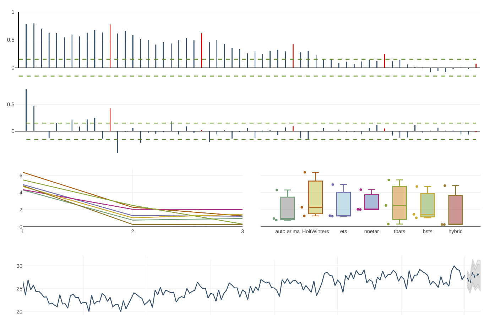

# Resources for our Workshop "Predictive Analytics für Unternehmensprozesse" at Data-Science-Tag 2019

[Website](https://studium.hs-ulm.de/de/research/Seiten/Datasciencetag.aspx) for Data-Science-Tag 2019 Hochschule Ulm

Our slides can be found here: 
[Taming Time Series!](hhttps://github.com/anofox/data_science_tag_2019/blob/master/Data%20Science%20Day%202019%20%40%20THU.pdf)

To start the notebook environment click on the batch below:

## Our Agenda
- Welcome  & Introduction
- Time Series are Everywhere! (Notebook)
- Hands-On Introduction to Algorithmic Forecasting. (Notebook)
- Real-world Business Forecasting
- Discussion & Wrap Up

## Abstract
In many situations it is necessary to make statements about the future. 
To decide whether to build a new power plant in the coming years requires 
predictions about energy demand. If you want to plan your distributors 
in the coming week, you need to predict order behavior. Planning a 
warehouse requires forecasts of demand. Forecasting periods range from 
several years (investments) to a few minutes (IoT monitoring). Regardless 
of the subject context and forecasting periods, forecasts are an extremely 
helpful tool to plan effectively and efficiently. This workshop introduces 
the prediction of R time series and gives an outlook on the use of deep 
learning methods.
